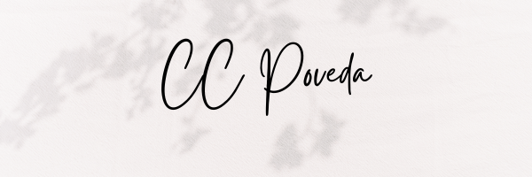

<h1 align="center"><b>Hola, soy Cristian Poveda 👋<h1>

<h3 align="center">Soy un apasionado desarrollador Front-End Colombiano</h3>

- 🌱 Actualmente estoy estudiado **HTML5, CSS3 y Javascript**

- 📫 ¿Cómo llegar a mi?: **ccpoveda.programador@gmail.com**

- ⚡ Lo que me gusta hacer: **Me gusta salir a caminar, el boxeo y los videojuegos... y codificar, por supuesto**

<h3 align="center">Conectate conmigo:</h3>

## <b> Skills</b>
 

    
- **Front-End Development**:

   
   
   

 

- **Extras**:
       

 
 

<!--
**CRISTIAN3322/CRISTIAN3322** is a ✨ _special_ ✨ repository because its `README.md` (this file) appears on your GitHub profile.

Here are some ideas to get you started:

- 🔭 I’m currently working on ...
- 🌱 I’m currently learning ...
- 👯 I’m looking to collaborate on ...
- 🤔 I’m looking for help with ...
- 💬 Ask me about ...
- 📫 How to reach me: ...
- 😄 Pronouns: ...
- ⚡ Fun fact: ...
-->
